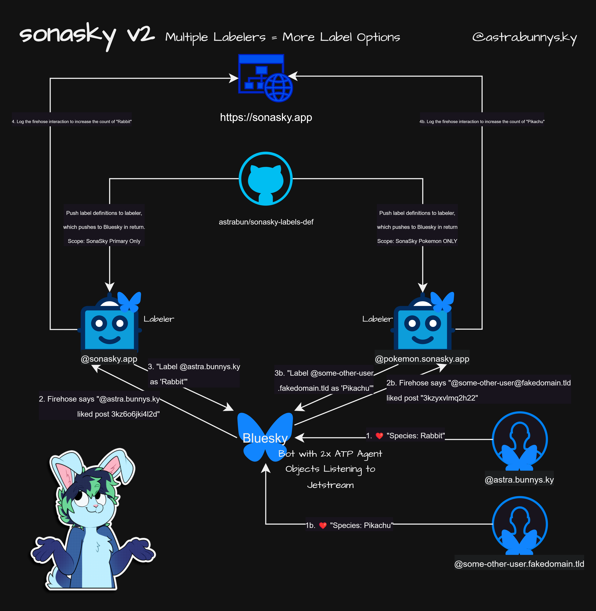

# SonaSky Labels

This repo is for storing species labels within [SonaSky](https://bsky.app/profile/sonasky.bsky.social) [[Github]](https://github.com/astrabun/sonasky) | [[Browse Labels]](https://sonasky-browse.bunnys.ky/) | [[Blog]](https://astrabun.com/projects/sonasky/). It replaces the now-archived repo, [sonasky-labels-localization](https://github.com/astrabun/sonasky-labels-localization). 

## Why the change

> Why did you change how the repo was set up/why are you using YAML now?

I think YAML is easier to use when contributing, it feels more forgiving than JSON. Eventually I convert back to JSON beause I have to, but this makes a lot more sense to me for storing definitions. I also wanted to shake up the purpose of the repo; previously, there was no real sync between the labeler's definitions and the localization repo - I had to pull both down, run a script to merge the two, and push them back up. My new goal with this repo is to make it the source of truth for label definitions.

Note: As described in https://github.com/bluesky-social/atproto/issues/2803, pushing all label definitions with translations turns out to be too big of a payload at the moment. So the definitions pushed to SonaSky on Bluesky will be English-only for the time being. However, the translations are still helpful for the Browse website. 

This also allows me to free up some space in the Bluesky-format label definitions as I can make categories/tags fields available for the Browse site without needing them in the localization description.

## Multi-Labeler Architecture

To continue to offer additional label options, SonaSky has scaled into multiple labelers based on "realm". At the time of writing, there are two realms: 1) prime, and 2) pokemon. This moves all Pokemon labelers onto a separate Ozone/labeler instance (@pokemon.sonasky.app).



A single bot listens to the Bluesky Jetstream for in-scope like events and uses the appropriate labeler (based on the "realm" property) to apply the label to the account.

As a result, users should subscribe to both available labelers to see all labels applied by this system.

## Automation

This repo automatically syncs labels from the repo to the SonaSky labeler on new commits to the `main` branch. 

## Localization

> looking for folks to help with translation! take a peek at `sonasky.yaml` to see if there's labels you can translate.

Languages: https://github.com/bluesky-social/social-app/blob/main/src/locale/languages.ts#L7C1-L25C2

Use the string value for the target locale you're contributing to. For example:

|Language|Lang value|
|---|---|
|English|`en`|
|Português (BR) – Portuguese (BR)|`pt-BR`|

### Example:

Example Species:

```yaml
rabbit:
  post: 3kz6o6jki4l2d
  realm: prime
  locales:
    - lang: en
      name: Rabbit
      description: "This user is a Rabbit! AKA: bunny, bnuy, bun"
    - lang: pt-BR
      name: Coelha/Coelho
      description: "Este usuário é um Coelho! AKA: Coelho, Coelinho."
```

Example Species that has a category:

```yaml
stoat:
  post: 3kzbz76vei22v
  realm: prime
  category:
    en: Mustelid
    pt-BR: Mustelídeo
  locales:
    - lang: en
      name: Stoat
      description: "This user is a Stoat!"
    - lang: pt-BR
      name: Arminho
      description: "Este usuário é um Arminho! AKA: Furão."
```

Categories make it easier to search/filter/sort on https://sonasky-browse.bunnys.ky/

# Thank You

Special thanks to [JSimian](https://github.com/JSimian), [DrkLws](https://github.com/DrkLws), [InsertyEXE](https://github.com/InsertyEXE), and [DarkraiNemo](https://github.com/DarkraiNemo), who all contributed to pt-BR translations in the archived repo. See their commits [here](https://github.com/astrabun/sonasky-labels-localization/graphs/contributors), as they are not reflected in this new repo's commit history.
